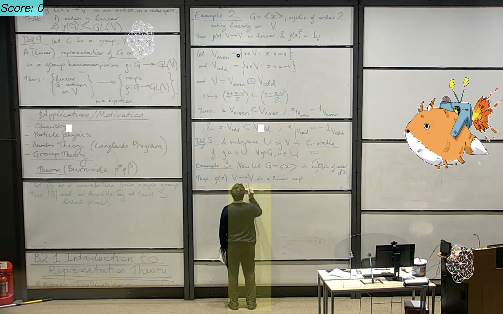

# Description
[](https://www.youtube.com/watch?v=J5YNJJJmtlw)

## Inspiration
Our main objective is to provide a fun way to "focus" on the mathematics lecture, by allowing the ~~player~~ user to keep track of the lecturer's face, movement as well as the whiteboard. 

摸鱼(Mō yú, lit. "to stroke fish"), the namesake of our project, is an ancient oriental art of ~~slacking off~~ conserving internal energy while performing painstaking work; indeed, picture how you would catch a fish with your bare hands. 

## What it does
It is essentially a game played on a customized lecture video with interaction. The player aims to control a flying fox in the space of the lecture theatre and shoot tiles towards the main boss: the lecturer to get points. However, whenever the lecturer is looking at you, he/she will summon a turret that shoots bullets at your fox. If you happen to run into the turret, you will experience an instant death; so try to destroy them as fast as possible! Careful — getting hit by the turrets' bullets will make your fox bigger in size, making it harder and harder to survive.

## How we built it
- Pytorch and modern deep learning technologies;
- Javascript and voodoo magic.

More seriously:
- deploy a facial recognition model and YoloV5 for the object detection model;
- process the lecture video and produce a JSON file for the frontend;
- use Pixi.js to render the game stage.

## Challenges we ran into
~~Javascript~~

## Accomplishments that we're proud of
- We outsmarted Javascript
- We are actually gonna use it for our lectures
- We got to see the sunrise ~~of course not because we've barely slept~~

## What we learned
~~How to javascript~~ Nothing

## What's next for Moyu_Simulator
More turret types, more bullet types, and more interaction suited to the user's lecture video


# Pixi.JS TypeScript boilerplate

I had a hard time setting up a development environment, so I decided to share it.
It can be useful to start from there if you want to start developping a game for browsers quickly.
This setup is supposed to be used with VS Code, as configuration is provided so that you hava all tools set up.


## Requirements

-   Node JS and NPM
-   VS Code
-   Chrome

## Setup

```bash
npm install
```

## Development

Launch the `Complete development` launch configuration.

Putting/removing breakpoints in the `.ts` files with VS Code in `/src` should work.
If it does not, please open an issue.

Edit the TypeScript files, the browser should refresh on save.